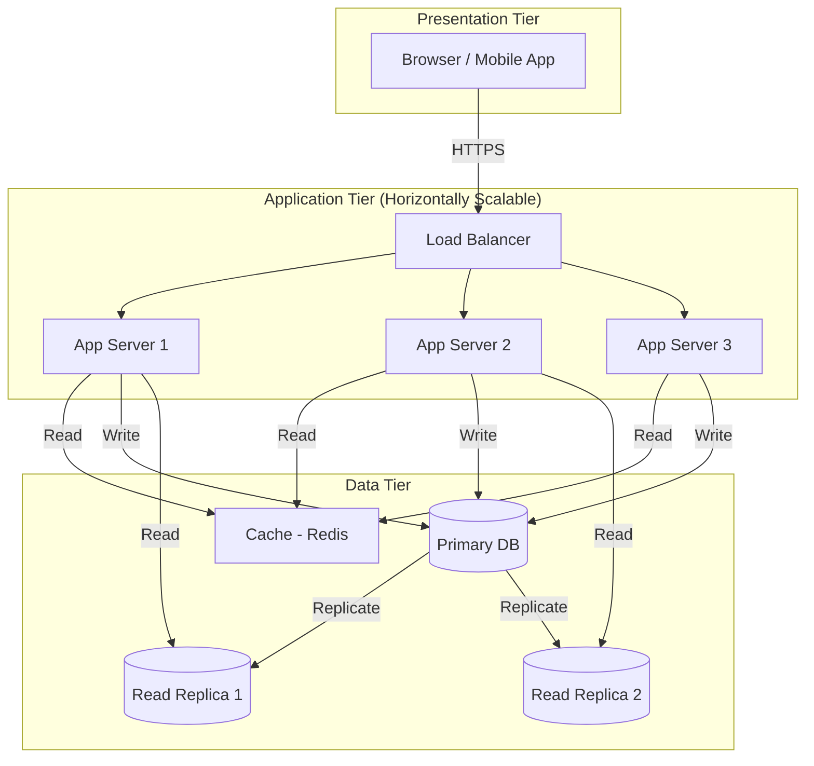

# Diagram: Three-Tier Architecture

## Overview
The three-tier architecture is the foundation of most web applications. Understanding it is prerequisite to understanding how to scale any system.

## Mermaid.js Diagram



## ASCII Alternative

```
                    ┌─────────────────────┐
                    │   Browser / App     │
                    └──────────┬──────────┘
                               │ HTTPS
                    ┌──────────▼──────────┐
                    │    Load Balancer    │
                    └──┬──────┬──────┬───┘
                       │      │      │
              ┌────────▼─┐ ┌──▼───┐ ┌▼────────┐
              │ App Srv 1│ │ Srv 2│ │ Srv 3   │
              └────────┬─┘ └──┬───┘ └┬────────┘
                       │      │      │
              ┌────────▼──────▼──────▼────────┐
              │         Cache (Redis)          │
              └────────────────────────────────┘
                       │      │      │
              ┌────────▼──────▼──────▼────────┐
              │      Primary Database          │
              └────────────────────────────────┘
                       │              │
              ┌────────▼──┐    ┌──────▼────────┐
              │ Read Rep 1│    │  Read Rep 2   │
              └───────────┘    └───────────────┘
```

## What Each Component Does

### Load Balancer
- Receives all incoming traffic
- Distributes requests across app servers
- Health checks servers and removes unhealthy ones
- Can terminate SSL/TLS

### App Servers (Stateless)
- Run your business logic
- Must be stateless (no local session storage)
- Can be added/removed without downtime
- Communicate with cache and database

### Cache (Redis)
- Stores frequently accessed data in memory
- Dramatically reduces database load
- Typical hit rate: 80-95%
- Data can be lost (it's a cache, not a source of truth)

### Primary Database
- Source of truth for all data
- Handles all writes
- Can become a bottleneck under heavy write load
- Protected by the cache for reads

### Read Replicas
- Copies of the primary database
- Handle read traffic (which is usually 80-90% of queries)
- Slight replication lag (eventual consistency)
- Can be promoted to primary if primary fails

## Scaling Each Tier

| Tier | How to Scale | Complexity |
|------|-------------|------------|
| Presentation | CDN, edge caching | Low |
| Application | Add more servers | Low (if stateless) |
| Cache | Redis Cluster, more nodes | Medium |
| Database | Read replicas, then sharding | High |

## Key Insight
The data tier is always the hardest to scale. This is why Weeks 2 and 3 focus heavily on database scaling strategies.
