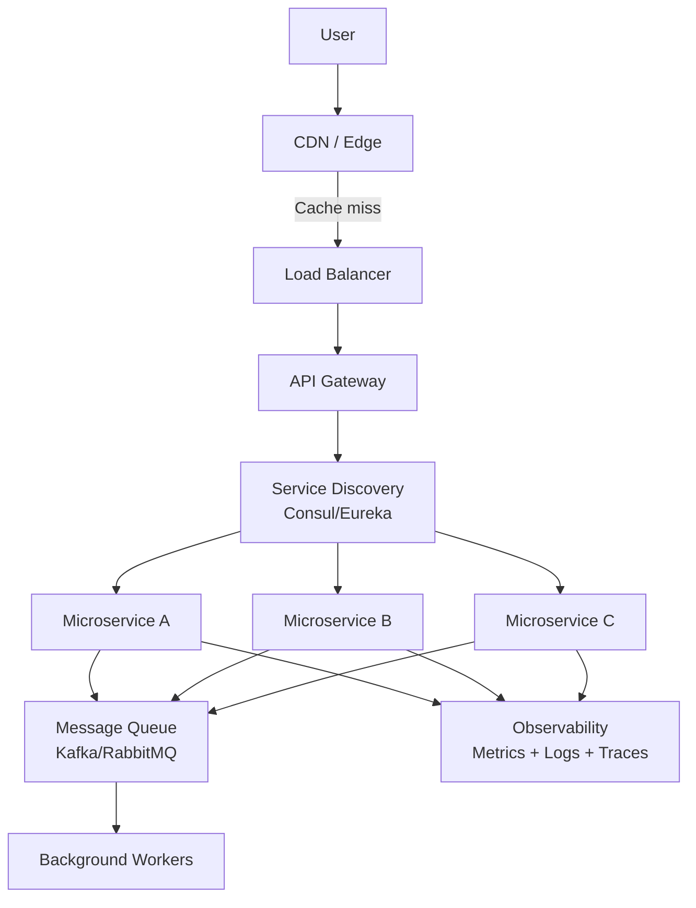

# Week 3 Review: Microservices and Distributed Patterns

## What We Covered This Week

Week 3 moved from data storage into service architecture. You learned how to break a monolith into microservices, design APIs, discover services, handle distributed transactions, observe your systems, and deliver content globally.

---

## Microservices — The Architecture and Its Pain

The core promise: independent deployability, independent scalability, team autonomy.

The core reality: you've traded in-process function calls for network calls, and everything that implies.

```
Monolith:
  UserService.getUser(id)  ← in-process, fast, transactional

Microservices:
  GET /users/{id}  ← network call, can fail, can be slow, no transaction
```

**The 8 Fallacies of Distributed Computing** (still true in 2024):
1. The network is reliable
2. Latency is zero
3. Bandwidth is infinite
4. The network is secure
5. Topology doesn't change
6. There is one administrator
7. Transport cost is zero
8. The network is homogeneous

**When microservices make sense**:
- Large teams (Conway's Law: architecture mirrors org structure)
- Different scaling requirements per service
- Different technology requirements per service
- Independent deployment velocity needed

**When they don't**:
- Small teams (< 10 engineers)
- Early-stage product (requirements change too fast)
- Simple domain (the overhead isn't worth it)

---

## API Design — The Contract Between Services

### REST Principles
```
Resource-based URLs:
  GET    /users/{id}        ← read
  POST   /users             ← create
  PUT    /users/{id}        ← replace
  PATCH  /users/{id}        ← partial update
  DELETE /users/{id}        ← delete

Stateless: each request contains all needed info
Cacheable: GET responses can be cached
```

### GraphQL vs REST
```
REST: multiple round trips for related data
  GET /users/1
  GET /users/1/posts
  GET /posts/5/comments

GraphQL: one query, exactly the data you need
  query {
    user(id: 1) {
      name
      posts {
        title
        comments { text }
      }
    }
  }
```

GraphQL wins for: complex data graphs, mobile clients (bandwidth), rapid iteration
REST wins for: simple CRUD, caching, public APIs, simplicity

### API Versioning Strategies
```
URL versioning:    /v1/users, /v2/users  ← most common
Header versioning: Accept: application/vnd.api+json;version=2
Query param:       /users?version=2
```

---

## Service Discovery — Finding Each Other

In a dynamic environment (containers, auto-scaling), service IPs change constantly. Service discovery solves this.

### Client-Side Discovery
```
Service A → Registry (Consul/Eureka) → get list of Service B instances
Service A → picks one (load balancing logic in client)
```
- Client has control over load balancing
- Client must implement discovery logic

### Server-Side Discovery
```
Service A → Load Balancer → Registry → Service B
```
- Client is simple (just calls load balancer)
- Load balancer is a potential bottleneck

### DNS-Based Discovery
```
service-b.internal → DNS → [10.0.1.1, 10.0.1.2, 10.0.1.3]
```
- Simple, works with any language
- DNS TTL can cause stale entries

---

## Distributed Transactions — The Hard Problem

ACID transactions are easy in a single database. Across services, they're hard.

### Two-Phase Commit (2PC)
```
Phase 1 (Prepare):
  Coordinator → "Can you commit?" → Service A: "Yes"
  Coordinator → "Can you commit?" → Service B: "Yes"

Phase 2 (Commit):
  Coordinator → "Commit!" → Service A: commits
  Coordinator → "Commit!" → Service B: commits
```
- Blocking protocol — if coordinator crashes, participants are stuck
- Not suitable for high-throughput systems

### Saga Pattern
```
Choreography-based:
  OrderService → OrderCreated event
  PaymentService → listens → PaymentProcessed event
  InventoryService → listens → InventoryReserved event
  ShippingService → listens → ShipmentCreated event

If payment fails:
  PaymentService → PaymentFailed event
  OrderService → listens → cancels order
```
- No central coordinator
- Compensating transactions for rollback
- Eventually consistent (not ACID)

---

## Observability — Knowing What's Happening

The three pillars:

### Metrics (What is happening?)
```
Counters:   requests_total, errors_total
Gauges:     active_connections, memory_usage
Histograms: request_duration_seconds (p50, p95, p99)
```

**The Four Golden Signals** (Google SRE):
1. Latency (how long requests take)
2. Traffic (how many requests)
3. Errors (how many fail)
4. Saturation (how full is the system)

### Logs (What happened?)
```json
{
  "timestamp": "2024-01-01T10:00:00Z",
  "level": "ERROR",
  "service": "payment-service",
  "trace_id": "abc123",
  "message": "Payment failed",
  "user_id": "1001",
  "amount": 99.99,
  "error": "insufficient_funds"
}
```

Structured logging (JSON) > unstructured (plain text) for searchability.

### Traces (How did it flow?)
```
Request: trace_id=abc123
  → API Gateway (5ms)
    → User Service (10ms)
      → Database (8ms)
    → Payment Service (150ms)  ← slow!
      → External Payment API (140ms)  ← root cause
```

Distributed tracing (Jaeger, Zipkin, AWS X-Ray) shows the full request path across services.

---

## CDN and Edge — Getting Content Close to Users

```
Without CDN:
  User in Tokyo → Server in Virginia → 200ms latency

With CDN:
  User in Tokyo → CDN PoP in Tokyo → 5ms latency
  (content cached at edge)
```

**What to cache at the edge**:
- Static assets (JS, CSS, images) — long TTL
- API responses (product catalog, public data) — short TTL
- HTML pages (SSR) — varies

**Cache invalidation strategies**:
- TTL-based: content expires after N seconds
- Purge: explicitly invalidate on update
- Versioned URLs: `/app.v2.js` — old URL still works, new URL is new content

**Edge computing** (Cloudflare Workers, Lambda@Edge):
- Run code at CDN nodes
- A/B testing, auth, personalization at the edge
- Reduces origin load

---

## The Week 3 Architecture Pattern



---

## Interview Cheat Sheet

**"How do you handle a distributed transaction?"**
→ Saga pattern with compensating transactions. Avoid 2PC in high-throughput systems.

**"How do microservices find each other?"**
→ Service registry (Consul/Eureka) + client-side or server-side discovery. DNS for simpler setups.

**"What's the difference between metrics, logs, and traces?"**
→ Metrics = aggregated numbers (what), Logs = events (what happened), Traces = request flow (how)

**"When would you use GraphQL over REST?"**
→ Complex data requirements, mobile clients, when you need to avoid over/under-fetching

**"How do you debug a slow request in a microservices system?"**
→ Distributed tracing (find the slow span), then metrics (is it always slow?), then logs (what happened?)
