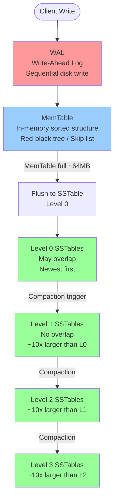
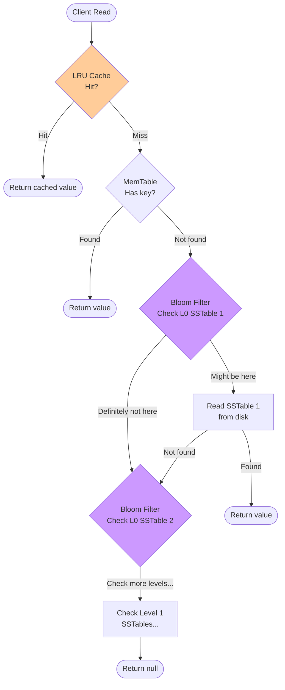
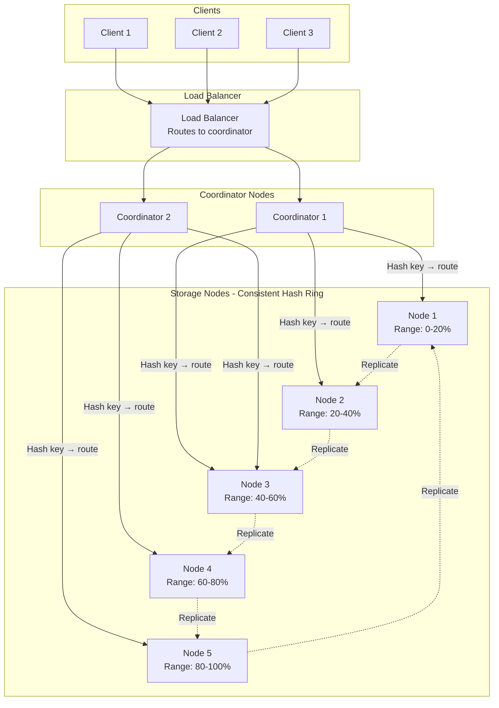

# Key-Value Store Architecture Diagrams

## 1. LSM Tree Write Path



## 2. LSM Tree Read Path



## 3. Distributed KV Store Architecture



## 4. Consistent Hash Ring

```
                    0°
                  Node A
                 /       \
           315°             45°
          Node E           Node B
           |                 |
           |   Hash Ring     |
          270°             90°
          Node D           Node C
                 \       /
                  225°
                  (empty)

Key "user:1001" → hash → 127° → Node C (next clockwise)
Key "user:1002" → hash → 280° → Node D (next clockwise)
Key "user:1003" → hash → 350° → Node A (next clockwise)

Replication (N=3): each key stored on 3 consecutive nodes
"user:1001" → primary: Node C, replica1: Node D, replica2: Node E
```

## 5. SSTable File Format

```
┌─────────────────────────────────────────────────────┐
│                    SSTable File                      │
├─────────────────────────────────────────────────────┤
│  Data Block 1 (4KB)                                 │
│  ┌─────────────────────────────────────────────┐   │
│  │ "alice" → "data..."  (offset: 0)            │   │
│  │ "bob"   → "data..."  (offset: 45)           │   │
│  │ "carol" → TOMBSTONE  (offset: 89)           │   │
│  └─────────────────────────────────────────────┘   │
│  Data Block 2 (4KB)                                 │
│  ┌─────────────────────────────────────────────┐   │
│  │ "dave"  → "data..."  (offset: 4096)         │   │
│  │ "eve"   → "data..."  (offset: 4140)         │   │
│  └─────────────────────────────────────────────┘   │
│  ...more data blocks...                             │
├─────────────────────────────────────────────────────┤
│  Index Block                                        │
│  ┌─────────────────────────────────────────────┐   │
│  │ "alice" → offset 0                          │   │
│  │ "bob"   → offset 45                         │   │
│  │ "carol" → offset 89                         │   │
│  │ "dave"  → offset 4096                       │   │
│  │ "eve"   → offset 4140                       │   │
│  └─────────────────────────────────────────────┘   │
├─────────────────────────────────────────────────────┤
│  Bloom Filter (10 bits/key, ~1% false positive)     │
├─────────────────────────────────────────────────────┤
│  Footer (offsets to index and bloom filter)         │
└─────────────────────────────────────────────────────┘
```

## 6. Compaction: Before and After

```
BEFORE COMPACTION (4 SSTables, Level 0):

SSTable 1 (oldest): alice=1, bob=2, carol=3
SSTable 2:          bob=99, dave=4          ← bob updated
SSTable 3:          alice=TOMBSTONE          ← alice deleted
SSTable 4 (newest): carol=TOMBSTONE, eve=5  ← carol deleted

Read "bob": check SSTable 4 (not found) → SSTable 3 (not found) 
           → SSTable 2 (found! bob=99) ✓
           = 3 SSTable reads!

AFTER COMPACTION (1 SSTable, Level 1):

SSTable merged: bob=99, dave=4, eve=5
(alice and carol removed — tombstones purged)

Read "bob": check SSTable 1 (found! bob=99) ✓
           = 1 SSTable read!
```

## 7. Quorum Reads and Writes

```
N=3 replicas, W=2, R=2 (strong consistency: W+R > N)

WRITE "user:1" = "Alice":
  Coordinator → Node A: ACK ✓
  Coordinator → Node B: ACK ✓  ← W=2 achieved, return success
  Coordinator → Node C: (still in flight, will eventually sync)

READ "user:1":
  Coordinator → Node A: "Alice" ✓
  Coordinator → Node B: "Alice" ✓  ← R=2 achieved, return "Alice"
  (Node C not needed)

NETWORK PARTITION (Node C isolated):
  W=2: Can still write to A and B ✓
  R=2: Can still read from A and B ✓
  → System remains available during partition!

EVENTUAL CONSISTENCY (W=1, R=1):
  Write to any 1 node → return success
  Read from any 1 node → might get stale data
  → Higher availability, lower consistency
```
