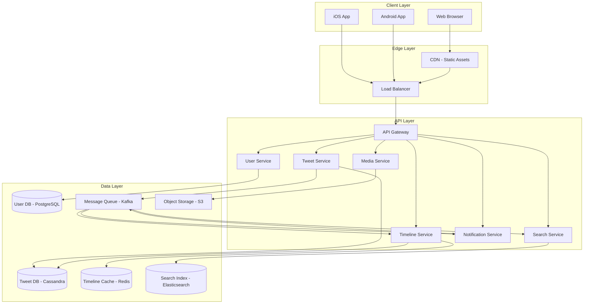

# Twitter Architecture Diagram

## High-Level Architecture



## ASCII Architecture

```
Users (Web/iOS/Android)
         │
    ┌────▼────┐
    │   CDN   │ ← Static assets, media
    └────┬────┘
         │
    ┌────▼────────┐
    │ Load Balancer│
    └────┬────────┘
         │
    ┌────▼────────────────────────────────────────────┐
    │                  API Gateway                     │
    │  (Auth, Rate Limiting, Routing)                  │
    └──┬──────┬──────┬──────┬──────┬──────────────────┘
       │      │      │      │      │
    ┌──▼──┐ ┌─▼──┐ ┌─▼──┐ ┌─▼──┐ ┌─▼──────────┐
    │Tweet│ │User│ │Time│ │Srch│ │Notification│
    │ Svc │ │ Svc│ │line│ │ Svc│ │   Service  │
    └──┬──┘ └─┬──┘ └─┬──┘ └─┬──┘ └─┬──────────┘
       │      │      │      │      │
       │      │      │      │      │
    ┌──▼──────────────────────────────────────────┐
    │                  Kafka                       │
    │  Topics: tweets, follows, likes, retweets   │
    └──┬──────────────────────────────────────────┘
       │
    ┌──▼──────────────────────────────────────────┐
    │              Fan-out Service                 │
    │  (Writes tweets to follower timelines)       │
    └──┬──────────────────────────────────────────┘
       │
    ┌──▼──────────────────────────────────────────┐
    │           Timeline Cache (Redis)             │
    │  user_id → [tweet_id_1, tweet_id_2, ...]    │
    └─────────────────────────────────────────────┘
```

## Component Descriptions

### API Gateway
- Authentication (JWT validation)
- Rate limiting (per user, per endpoint)
- Request routing to appropriate service
- SSL termination

### Tweet Service
- Creates, reads, deletes tweets
- Stores in Cassandra (high write throughput)
- Publishes `TweetCreated` event to Kafka

### Timeline Service
- Serves home timeline (tweets from followed users)
- Reads from Redis cache (pre-computed timelines)
- Falls back to Cassandra on cache miss

### Fan-out Service
- Consumes `TweetCreated` events from Kafka
- Writes tweet ID to each follower's timeline cache
- Handles celebrity problem (skip fan-out for users with > 1M followers)

### Search Service
- Indexes tweets in Elasticsearch
- Handles full-text search and hashtag search
- Trending topics computation

### Media Service
- Handles image/video upload
- Stores in S3
- Generates CDN URLs for media
