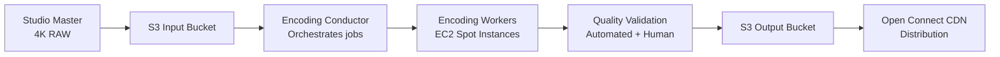

# Netflix Component: Video Encoding Pipeline

## Overview

Before any video can be streamed, it must be encoded into hundreds of variants. This is a massive offline processing pipeline.

## Why Multiple Variants?

```
A single 2-hour movie needs:
  Resolutions: 4K, 1080p, 720p, 480p, 360p, 240p
  Codecs: H.264 (compatibility), H.265/HEVC (efficiency), AV1 (best compression)
  Audio: Stereo, 5.1 surround, Dolby Atmos, multiple languages
  Subtitles: 50+ languages

Total variants per title: ~1,200 files

Why?
  - Different devices support different codecs
  - Different network speeds need different bitrates
  - Adaptive bitrate streaming switches between variants mid-playback
```

## Encoding Pipeline Architecture



## Parallelization Strategy

```python
# A 2-hour movie = 7,200 seconds of video
# Split into 2-minute chunks = 60 chunks
# Encode each chunk in parallel across 60 machines
# Then stitch back together

def encode_title(source_file, title_id):
    # 1. Split into chunks
    chunks = split_video(source_file, chunk_duration=120)  # 2 min each
    
    # 2. For each chunk, create encoding jobs for all variants
    jobs = []
    for chunk in chunks:
        for resolution in ["4k", "1080p", "720p", "480p", "360p"]:
            for codec in ["h264", "h265", "av1"]:
                jobs.append(EncodingJob(
                    chunk=chunk,
                    resolution=resolution,
                    codec=codec,
                    title_id=title_id
                ))
    
    # 3. Submit to job queue (SQS)
    # 4. EC2 Spot instances pick up jobs
    # 5. Results stored in S3
    # 6. Conductor stitches chunks back together
    
    # Total jobs: 60 chunks × 5 resolutions × 3 codecs = 900 jobs
    # With 900 machines: ~1 hour wall clock time for a 2-hour movie
```

## Adaptive Bitrate Streaming (ABR)

```
Video is split into 2-10 second segments.
Each segment is encoded at multiple bitrates.
Player downloads segments and switches quality based on bandwidth.

Manifest file (HLS .m3u8):
  #EXTM3U
  #EXT-X-STREAM-INF:BANDWIDTH=800000,RESOLUTION=640x360
  360p/segment.m3u8
  #EXT-X-STREAM-INF:BANDWIDTH=2000000,RESOLUTION=1280x720
  720p/segment.m3u8
  #EXT-X-STREAM-INF:BANDWIDTH=5000000,RESOLUTION=1920x1080
  1080p/segment.m3u8

Player logic:
  - Measure download speed of last segment
  - If speed > 5 Mbps: request 1080p next segment
  - If speed drops to 2 Mbps: switch to 720p
  - If speed drops to 0.8 Mbps: switch to 360p
  - Buffer 30 seconds ahead to absorb fluctuations
```

## AV1: The Future of Video Compression

Netflix invested heavily in AV1 (open-source codec):
- 30-50% better compression than H.264 at same quality
- A 1080p stream at 4 Mbps in H.264 = 2.5 Mbps in AV1
- Saves Netflix ~$1B/year in bandwidth costs
- Tradeoff: encoding is 10-50x slower than H.264

## Storage Costs

```
Average encoded size per title (all variants): ~100 GB
Netflix catalog: ~15,000 titles
Total storage: ~1.5 PB

With 3x replication across regions: ~4.5 PB
At $0.023/GB/month (S3): ~$103,500/month just for storage

Open Connect (own CDN) reduces this significantly:
  - Content stored on OCA hardware (amortized cost)
  - No per-GB transfer fees to ISPs
  - Netflix estimates $1B+ savings vs. using commercial CDN
```
